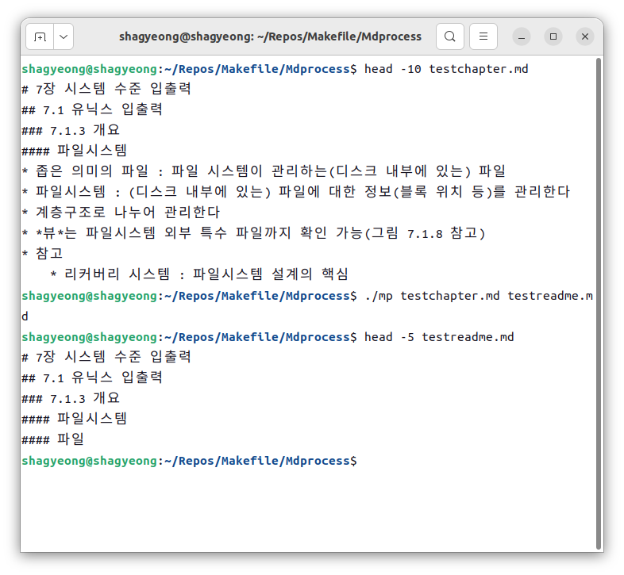
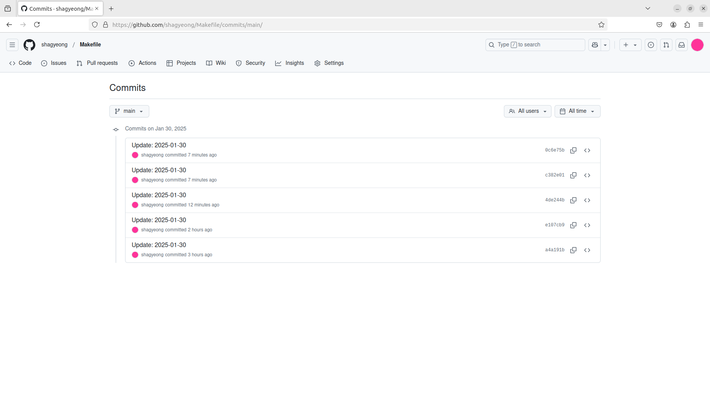

# Makefile: C 파일 입출력 프로젝트
# Mdprocess: 마크다운 입출력
## 프로젝트 요약
### 주요 기능
- heading 단위 마크다운 입출력
- Git commit 메시지 작성
### 테스트 환경
- Ubuntu 22.04
### 테스트
- 

# Commitcomment: 커밋 메시지 작성
## 프로젝트 요약
### 주요 기능
- 구조체 tm 기반 commit 날짜 출력
- *commit 디렉터리 지정(명령행 인자)*
- *commit 키워드, 사용자 코멘트 출력*
### 테스트 환경
- Ubuntu 22.04
### 테스트
- 디폴트(commit)
   ```
    $ make clean
    rm -f main.o getdate.o libcommitcomment.a cc commit
    $ make
    gcc    -c -o main.o main.c
    gcc    -c -o getdate.o getdate.c
    ar rs libcommitcomment.a getdate.o
    ar: creating libcommitcomment.a
    gcc -o cc main.o -L. -lcommitcomment -static
    $ ./cc
    git add *
    git commit -m "Update: 2025-01-30"
    [main c382e01] Update: 2025-01-30
     10 files changed, 5 insertions(+), 62 deletions(-)
     (...)
- 옵션 -p(push)
    ```
    $ ./cc -p
    -p: push
    git add *
    git commit -m "Update: 2025-01-30"
    git push origin main
    [main 0c6e75b] Update: 2025-01-30
     1 file changed, 1 insertion(+)
    오브젝트 나열하는 중: 32, 완료.
    오브젝트 개수 세는 중: 100% (32/32), 완료.
    (...)
    ```
- GitHub.com/shagyeong/Makefile
    
