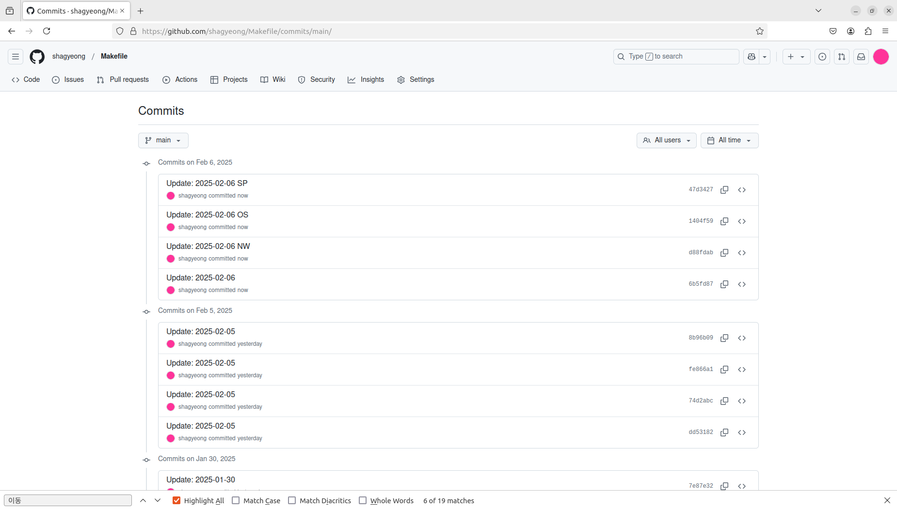

# Makefile: C 파일 입출력 프로젝트
# Mdprocess: 마크다운 입출력
## 프로젝트 요약
### 주요 기능
- heading 단위 마크다운 입출력
- Git commit 메시지 작성
### 테스트 환경
- Ubuntu 22.04
### 테스트
- 

# Commitcomment: 커밋 메시지 작성
## 프로젝트 요약
### 주요 기능
- 구조체 tm 기반 commit 날짜 출력
- *commit 디렉터리 지정(명령행 인자)*
- *commit 키워드, 사용자 코멘트 출력*
### 테스트 환경
- Ubuntu 22.04
### 테스트
- 디폴트(push)
   ```
    $ make clean
        rm -f main.o getdate.o libcommitcomment.a cc commit
    $ make
        gcc    -c -o main.o main.c
        gcc    -c -o getdate.o getdate.c
        ar rs libcommitcomment.a getdate.o
        ar: creating libcommitcomment.a
        gcc -o cc main.o -L. -lcommitcomment -static
    $ ./cc NW OS SP
        git add *
        git commit -m "Update: 2025-02-06 NW"
        git push origin main
        [main d88fdab] Update: 2025-02-06 NW
         1 file changed, 3 insertions(+)
        (...)
        git add *
        git commit -m "Update: 2025-02-06 OS"
        git push origin main
        [main 1404f59] Update: 2025-02-06 OS
         1 file changed, 3 insertions(+)
        (...)
        git add *
        git commit -m "Update: 2025-02-06 SP"
        git push origin main
        [main 47d3427] Update: 2025-02-06 SP
         1 file changed, 3 insertions(+)
        (...)
    ```
- GitHub.com/shagyeong/Makefile
    
